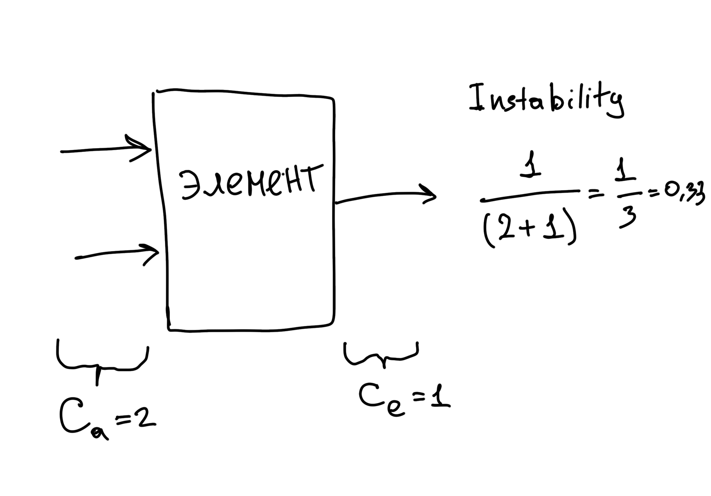
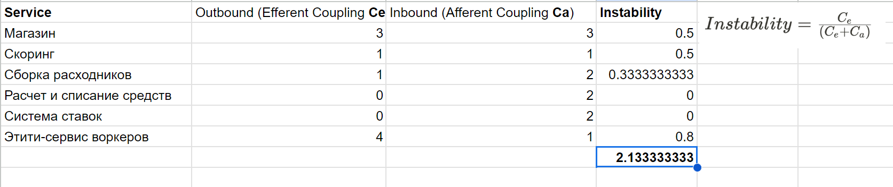
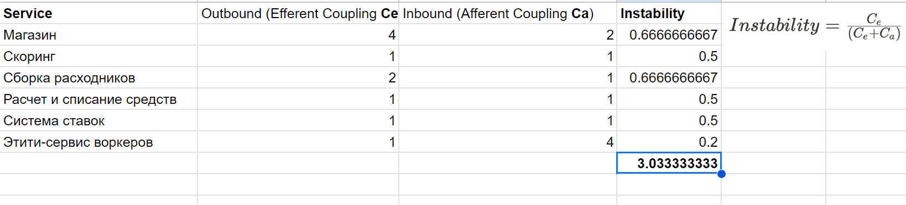
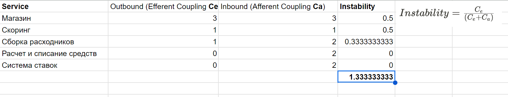
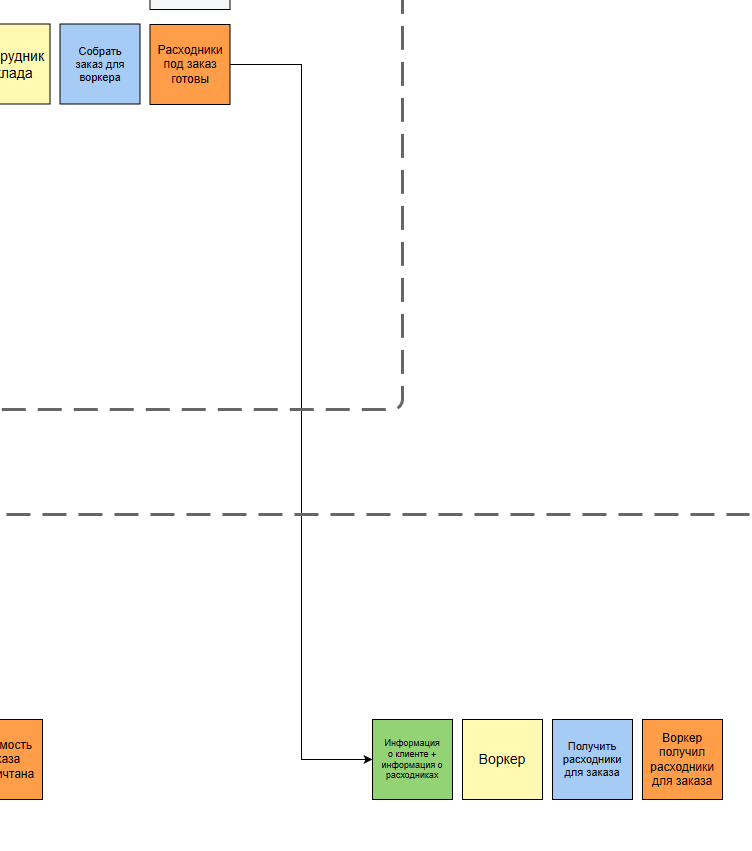
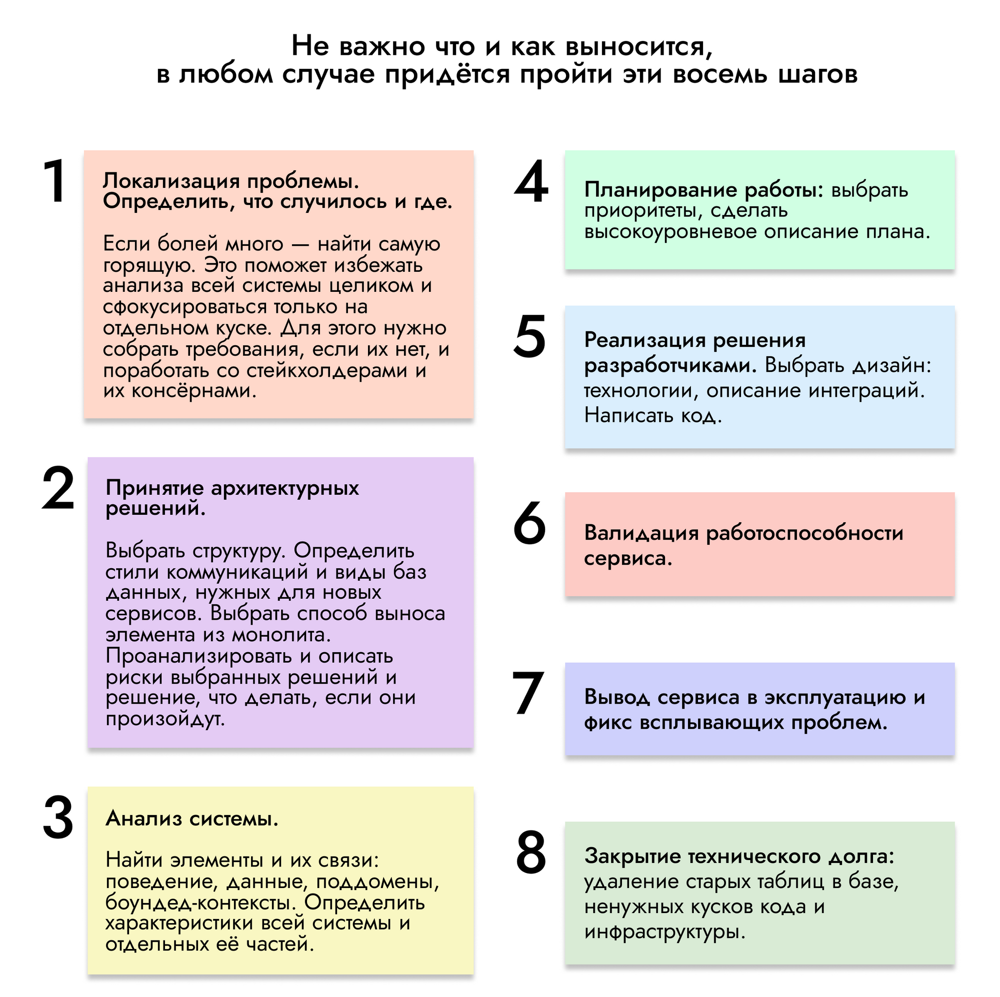
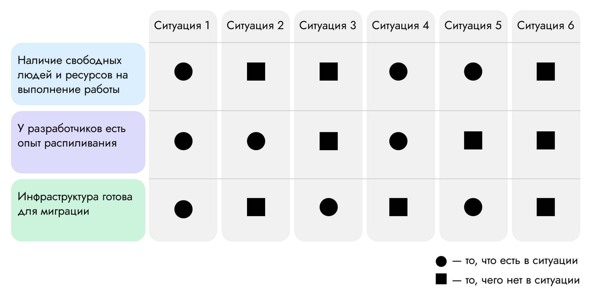
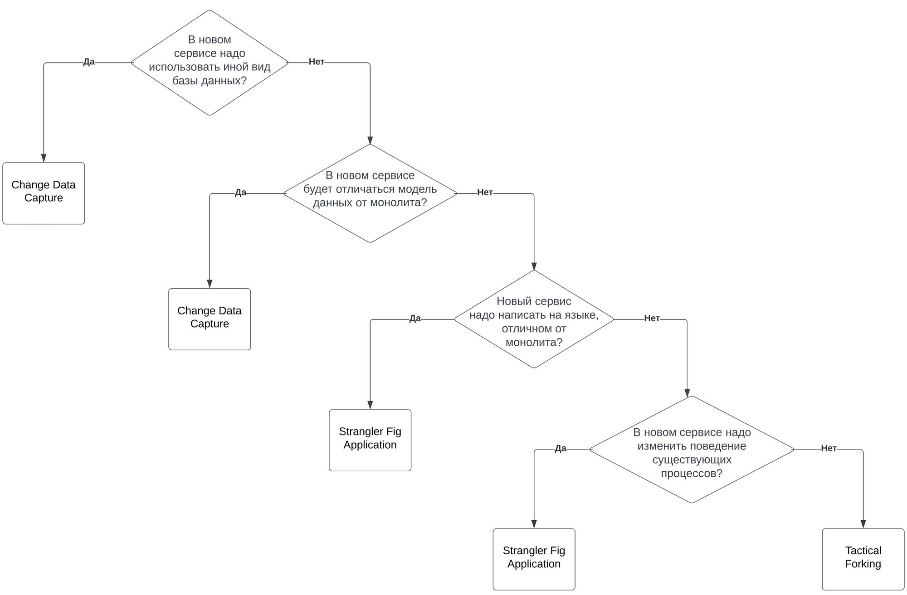

# Make Cats Free

Задача курса: **обучиться и получить набор навыков для обосновывания решения при выборе той или иной архитектуры проектируемой системы.** 

Описание задачи и требования здесь:
[Requirements](Requirements.md)

## Задание второй домашки

1. Core Domain Chart
2. Определить bounded-контексты, сделать модель с поддоменами
3. Описать разницу между bounded-контекстами первого урока и второго
4. Найти и выписать характеристики и выбрать один из четырех стилей

## Задание третьей домашки

1. Описать структуру системы с архиеткурными стилями
2. Выбрать виды баз данных
3. Выбрать стили коммуникаций
4. Написать ADR

## Задание четвертой домашки (рефакторинг)

В этом уроке нам необходимо исправить систему, которую сделали до нас. Т. е. надо из «начальной системы» получить то, что у вас получилось в конце третьей домашки, + изменить систему под новые условия. Для того чтобы было интереснее, в качестве «начальной системы» я предлагаю выбрать один из двух вариантов: **Выбираю схему из домашки**

1. для каждого удалённого сервиса и связанных с ним сервисов посчитайте значение instability;
2. опишите, какие сервисы и боундед-контексты в каком месте и каким образом будут меняться;
3. спланируйте, как и в какой последовательности будет происходить работа. Можете выбрать одно из двух условий: нет людей, нет ресурсов.

# Рефакторинг

## Анализ instability

Для начала необходимо просчитать **instability** для всех текущих сервисов по формуле:

> Нестабильность всегда обозначается числом между 0 и 1. Чем значение ближе к 1, тем элемент нестабильнее.

Вот что получилось: 

В таблице:

Также посчитал сумму instability для всех элементов (**~ 2.13**), исходя из логики: **стабильность системы выше, чем выше стабильность каждого элемента**. Не уверен, что сумма, это  хороший показатель, но по крайне мере, он является самым простым интегральным, на котором можно провести следующий "эксперимент"

### Направление связей (эксперимент)

Увидел в чате обсуждение по поводу направления связей, действительно тема кажется важной при определении instability, т.к. итоговое значение может разительно отличаться, если входящие связи посчитать, как исходящие и наоборот.

Вначеле, схема элементов, а точнее, направление стрелок к/от 
энтити-сервиса воркеров вызвало вопросы.

В моей голове данный сервис явлется owner для воркеров, поэтому все процессы затрагивающие воркеров должны ссылаться на него, т.е. направление стрелок НЕ от энтити-сервиса воркеров а К нему (кроме скорига).

Я проанализировал и понял, что можно сделать несколько реализаций: одна которая представлена, т.е. когда сам сервис опрашивает другие об изменениях в процессах, касающихся воркеров. И другая, когда другие используют энтити-сервис для выполнения процесса, и тогда стрелки будут направлены как я предполагал вначале.

В итоге пересчитал instability "по своему" решению (поменял направление стрелок) и оно оказалось хуже, несмотря на то, что сам энтити-сервис стал стабильным из **0.8 -> 0.2**:

**2.13 (иcходное решение) vs 3.03 (изменены направления для энтити-сервиса воркеров)**. 

Следующим шагом, я просто **удалил энтити-сервис воркеров**, как будто его и нету, пересчитал показатели:

**2.13 (иcходное решение) vs 1.33 (энтити-сервис удален)**. 

Конечно, данный эксперимент, это больше про поиграться, чем докапаться до истины. Есть вопрос к интегральному показателю в виде суммы - кажется не очень надежный. Например, если применить формулу один раз, сложив все входящие связи и исходящие для всех элементов, то разница между вариантами уже не такая большая:

9 / (9 + 11) = **0.45 (иcходное решение)** vs 10 / (10 + 10) = **0.5 (изменены направления для энтити-сервиса воркеров)** vs 5 / (5 + 10) = **~0.33 (энтити-сервис удален)**

Но тем не менее, некоторые выводы для себя я сделал.

### Текущие выводы

- В первую очередь нужно **обращать внимание на количество стрелок** подходящих к элементу, а направление их вторично. Если даже элемент имеет много входящих свзей и является относительно стабильным, то делает он это за счет других элементов, т.к. входящая связь для него, является исходящей  для "соседей".

- **Избавление от связи эффективнее для системы вцелом, чем смена направления.**

- **Необходимо фокусироваться на элементах с экстремальными значениями instability близкими к 0 или 1.** И соответсвенно анализировать процессы, в которых данные элементы учавствуют.

## Анализ необходимых измений

Весь анализ изменений построю на основе целей урока:

- Добавить новый функционал как отдельный сервис. Применю это к требованиям [[Requirements#SC-050| При этом необходимо постоянно добавлять новые способы списания денег для клиентов]].
- Oбъединить технические шаги в общий сервис. Обкатаю на энтити-сервисе воркеров
- Вынести сервис из монолита. Применю на матчинг

### Объединение технических шагов в общий сервис

Исходя из оценки instability из предудущего шага необходима разобраться с процессами вокруг энтити-сервиса воркеров. 

Он имеет предельный показатель сейчас - 0,8. И даже если повернуть зависимости, и его показатель станет 0.2 (также предельным), т.е. он станет стабильным, то выигыша от этого никакого, т.к. он участвует в основном процессе выполнения заказа и все сервисы на нем завязаны. То что он "стабилен" -  это плохо, любые изменения в нём приведут к цепной реакции изменений в остальных.

**Нужно уменьшат количество связяй.** Обеъдинение позволит это сделать, рассмотрим кандидатов:

- Скорринг, вроде, кажется логичным, т.к. оттуда нам прилетают новые воркеры.
- Сборка расходников
- Сервис с планированием визитов, если рассматривать реализацию магазина, то возможна специальная часть для воркеров, как для продавцов.

Скоринг отметаем, потому что с требованиями: [[Requirements#C-010|Бизнес в будущем хочет продавать его другим компаниям и тестировать больше гипотез]] он явно становится сore-поддоменом, плюс: сокрее всего там возникнет  дополнительная сложность с интеграциями (для продажи решений)

Сервис с планированием визитов сам по себе сложный объединяет три контекста, для него потребуется рефакторинг.

**Поэтому остается объединение энтити-сервиса воркеров с Сборкой расходников (склад-доставка).** Плюс если посмотреть на ES диаграмму из первой домашки, то у меня как раз процесс выполенния заказа запускается контекстом склада:

Объединенный сервис будет owner для воркеров, и стримить изменения по ним в другие сервисы. Сам он будет добавлять воркера из кандидатов, принимая события, что новый кандидат добавлен от скорринга.

### Добавление нового функционала как отдельный сервис

Требование [[Requirements#SC-050|писывать деньги с клиентов каждую неделю слишком затратно для отдела..]], говорит, что списание и зачесления начинают "идти по разным дорогам". 

Сейчас имеем один сервис (фин-отдел), в котором выполняются и расчет и зачисление зарплаты и списание денег у клиента. 
Вместе с изменением условий (интервал списание средств), так же требуются новые варианты оплаты.

**Поэтому списания средств выделяем в отдельный сервис.** Плюс, так мы не трогаем интеграцию с Золотой шляпой для воркеров.

### Вынесение сервиса из монолита

**Матчинг один из ключевых элементов системы.** Алгоритм может меняться очень часто, достаточно сложный. При этом текущий поддомен, в котором он лежит отсносительно "устоявшийся" - почти классический магазин. Поэтому "распил" данного сервиса необходим. 

Плюс, кажется, для матчинга лучше подойдет не реляционная БД, например, графовая, а монолит в текущей схеме скорее использует реляционную, еще одно отличие.

## Планирование рефакторинга

Последовательность действий при модификации системы:

Ситтуации возникающие при рефакторинге:

// TODO: Выбор из двух условий: нет людей, нет ресурсов?

**Рассмотрю вариант, когда в ресурсы (разработчики и время) имеются, но при этом опыта распиливания нету**

В соотвествии с уроком при таком варианте необходимо начинать рефакторинг с самых простых и не критичных шагов.

### Шаг 1. Вынесение списания средств 

Данный шаг, кажется относительно простым. Интеграци. с Золотой шляпой мы не трогаем, но шанс конечно есть))

**В основу взял бы Code first: Tactical Forking.** 

Т.е. сделал полную копию сервиса, затем реализвал новый функционал по способам оплаты, изменению интервала оплаты, а затем в фоновом режиме в рамках технического долга избавился от кода зачесления ЗП воркерам.

### Шаг 2. Обединение энтити-сервиса воркеров

Основная задача обеспечить стриминг информации по воркерам, это первое что нужно решить. Его возможно обеспечить еще на этапе когда сервис не объединен.

После добавил API для воркеров в сервис склада (в который вливаем) и проводил редирект на старый энтити-сервис, и по мере того, как код в сервисе склада будет перенесен, удалил энтити-сервис

Похоже на **Сode First: Strangler Fig Application**, но в обратном порядке)

### Шаг 3. Распиливание "большого" монолита. Вынесение матчинга

Матчинг сильно связан с основным сервисом данными (Заказы, Клиенты, Оценки заказов). Если бы не было в необходимости использование БД другого типа (графовая вместо реляционной), то можно было начать с service-based подхода. Создать новый сервис, скопировав часть кода для матчинга на существующей БД.

Но, так как мы имеем различия в БД то по диаграмме:

**Получаем, что нужно следовать Data First: Change Data Capture**

Соответсвенно вначале нужно обеспечить наполнение новой БД. А после включать логику нового сервиса.

*Но при этом остается важная проблема - коммникация с магазином остается синхронной. До каких-то пор сервис будет держать нагрузку. После нужно будет решать вопрос с переходом на асинхронную коммуникацию.*

*Для этого я бы попытался проработать требований с бизнесом. Продавить то, что точная стоимость может расчитываться после оформление заказа, а вовремя оформления показывать диапазон. В этом случая нет необходимости опрашивать сразу.*