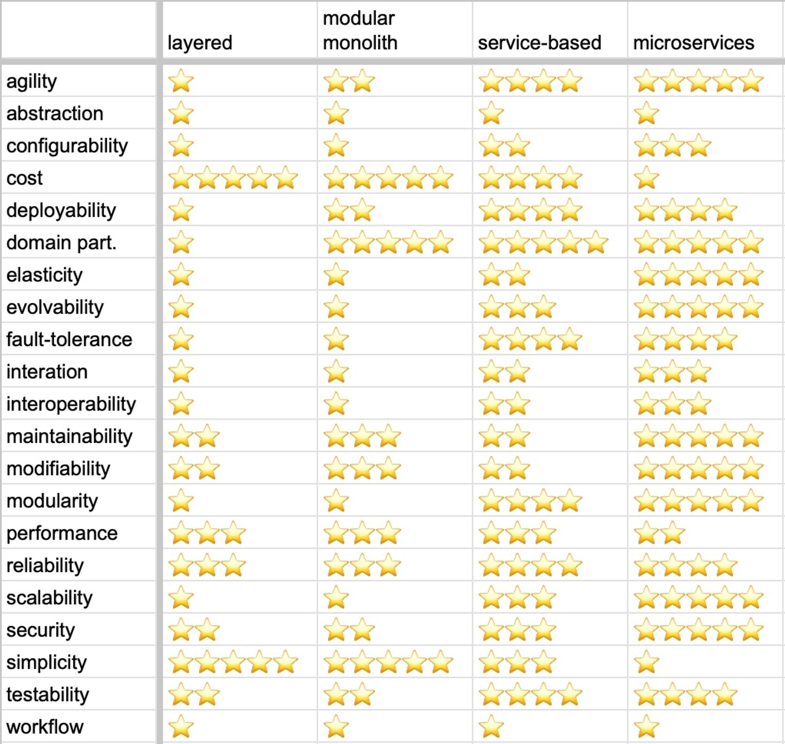

# Make Cats Free

Задача курса: **обучиться и получить набор навыков для обосновывания решения при выборе той или иной архитектуры проектируемой системы.** 

Описание задачи и требования здесь:
[Requirements](Requirements.md)

## Задание второй домашки

1. Core Domain Chart
2. Определить bounded-контексты, сделать модель с поддоменами
3. Описать разницу между bounded-контекстами первого урока и второго
4. Найти и выписать характеристики и выбрать один из четырех стилей

# Анализ

Основным результатом анализа являются **обнаруженные элементы системы и их связи.** Поэтому, говоря о анализе в двух словах, можно сказать, что он должен быть выстроин таким образом, чтобы понять с какими элементами системы системы придется иметь дело команде разработки, и как связи между элементами повлияют на эту разработку. 

## Анализ домена

*Анализ домена компании является стратегическим анализом. Через основные цели компании и область, которой они занимаются можно делать некий прогноз и анализировать не только текущее состояние системы, а и возможные направления её развития*

**Главная цель MCF - это освободить котов-тестировщиков от рутинной работы, осовбождая им дополнительное время на более важные дела).**

Основываясь на главной цели, стараясь максимально абстрагироваться от технической реализации, я бы выделил четыре основных поддомена:

- Выполнение работы (заказов) для клиентов
- Поиск новых воркеров (кандидатов)
- Обеспечение качества работы
- Повышение эффективности работников

Разместил их на диаграмме Code Domain Chart

### Поддомены & bounded-контексты

#### Выполнение работы для клиентов 

Определено это **сore**-поддомен. **Во-первых**, он решает основную задачу, соотвественно определяет уникальность MCF: формирования заявки, подбор воркеров под заявку и исполнение, т.е. **непосредственно помощь клиенту**.  **Во-вторых**, относительно сложный. Сложность обусловлена и самим алгоритмом матчинга (явно указано в требованиях) и взамодействием со снабжением: закупка печенек, обязательный набор расходников (состав критичен для выполнения работы).

Этот поддомен единственный состоит из нескольких контекстов, остальные следуют правилу один поддомен - один контекст

Контексты:

- **"Магазин" услуг для клиентов** - ограничивает область связанную с выполением работы в основном с точки зрения клиента. Т.е. выбор/покупка услуги, отслеживанием статус выполнения, добавление редактирование новых услуг (менеджер).

- **Процесс подбора воркера** - матчинг, алгоритм уникален и скорее всего будет со временем эволюционировать, темпы его изменений могут разительно отличаться от других контекстов

- **Сборка расходников (снабжение)** - снабжение всегда имеет свою специфику, для снабжения заказ - это набор реальных вещей, которые необходимо передать воркеру, а не набор услуг как для клиента, который оформляет заявку в магазине.

- Работа воркера (доставка услуги) - контекст очень близок к снабжению, но все же есть специфика, например, расходники для снабжения - это список вещей, в том числе печенье, которые можно обрабатывать по отдельности, а для воркера расходники это цельный пак.

**TODO**: откуда воркер берется? какой для него контекст является домом? Рассмотреть возможность объединения функционала снабжения и части касающегося воркера из "Выполнение заказов". Подробнее глянуть на модель данных

**TODO**: Обеспечения услуги в магазине не возможно без участия контекста матчинга. Что-то где-то не вяжется. Напрашивается объединение всего поддомена "Выполнение работы для клиентов" в один контекст.

**TODO**: Что делать с билингом в целом? Пока он мне видится чисто техническим шагом и не фигурирует как контекст

#### Поиск новых воркеров

Достаточно важная проблема, решение которой обеспечивает работу основного домена, но всё же между core и **supporting** выберу второй вариант. **Во-первых**, при нарушении функционирования данного поддомена работа не остановится сразу. **Во-вторых**, если его сравнивать с core-поддоменом "Выполнение работы для клиентов", то можно сказать, что он значительно проще.

В качестве тактики выбран вариант прождения тестирования кандидатами в воркеры, поэтому контекст называю "Тестирование кандидатов"

#### Проверка качества выполнения работы

Я бы выделил задачу проверки качества в **supporting**-поддомен. **Во-первых**, кажется  его  невозможно передать на аутсорс/купить, но явно, системы проверки качества существуют, высокий шанс адаптировать/заимстовать решения. **Во-вторых**, в краткосрочной перспективе остсутствие решения данной проблемы не повляиет на основную функцию MCF.

На текущий момент MCF добавляет только проверку качества выполнения заказов. Хотя, например, можно провести проверку качества расходников, в таком случае поддомен расширился бы до двух контекстов.

#### Повышение эффективности работников

Для повышения эффективности  работников MCF планирует  внедрить только "тотализатор" для менеджеров, поэтому поддомен соддержит один контекст связанный со ставками.

Здесь у меня дилемма: определить этот домен как supporting или как generic. **Во-первых**, он абсолютно не критичен для функционирования MCF, он имеет самое минимальное значение для бизнеса. **Во-вторых**, если бы я больше знал про существующие решения по ставкам, я бы определил его в generic, хотя всё зависит от системы, которую придумали в компании. Так как самое главное на текущем этапе определится с core (я его уже определил). Помечу его как **generic-supporting**.

Разместил поддомены и их контексты на общей диаграмме

### Сравнение контекстов с первым уроком

*Если обобщать, то анализ домена дал совершенно другой взгляд на систему чем анализ поведения и анализ данных. Не могу сказать, что он прояснил ситуацию в целом, скорее даже наоборот, вопросов появилось больше. Возможно если бы была возможность пообщаться с реальным бизнесом и погрузится в предметку, вопросов поуменьшилось. Но что есть, то есть - работа в неопределенности.*

(1) **Анализ домена заставил взглянуть на матчинг, как на отдельный контекст**, в первом уроке я его трактовал вообще не верно, воспринимал как отдельную внешнюю систему, рассматривал его как технический шаг несмотра на описание: хотя из него следует, что это и есть "фишка" (конкуретное преимущество) компании Make Cats Free.
Пока я выделил его как отдельный контекст, но судя по процессам он является неотъемлемой частью "Магазина услуг". И при реализации его в отдельном приложении будут проблемы. 

Надеюсь, что в дальнейшем удасться уменьшить связность, например, путем изменений требований (поговорить с бизнесом). Желательно отвязать стоимость работы, которая показывается клиенту перед оформлением от конкретного воркера, потому что, на мой взгляд это странно с точки зрения бизнеса. В идеале клиент должен заказать работу с фиксированной либо примерной стоимостью еще до подбора воркера, а уже после оформления, воркер мэтчится к заказу.

(2) Анализ домена заставил переимновать контексты. 

// TODO

## Анализ характеристик

Хотя в уроке выбор характеристик происходит для всей системы в целом, очевидно, что в реальности это не так, и каждая подзадача, т.е. поддомен или даже bounded-контекст может имееть свой набор характеристик. Поэтому в общем списке характеристик, по возможности сделаем пометки для какого поддомена/контекста та или иная характеристика актуальна

**agility**, **modifiability**

Если смотреть на график развития компании то **Make Cats Free, кажется, находится в состоянии Startup , т.е. это говорит о том, что к требованиям нужно относится не как зафиксированному правилу**, поэтому начну с  agility, modifiability характеристик. Они, скорее, актальны для всей системы а целом.

**deployability**, **testability**

Также и ключевые характеристики для поддержания [[Requirements#Additional|Низкий Time To Market]] являются общеми для всей системы

**scalability**, **security**

Актуальны для контекста тестирования кандидатов, потому что я видел требования, но сейчас не могу найти ссылку о необходимости держать нагрузку и быть защищенным от DDOS.

*Я думаю, что можно добавить весь набор доступных характеристик, в какой то степени они будут применимы, но насколько я понимаю, здесь мы фокусируемся на самые важные.*

## Выбор архитектурного стиля

Учитывая диаграмму сравнения стилей и выбор характеристиках на предыдущем этапе имею **выбор без выбора)) - микросервисы**

*Вообще странно, судя по диаграмме микросервисы - это почти всегда палочка- выручалачка, а на практике много подводных (и не очень) камней.*

**Думаю, что на каждый поддомен будет свой сервис, ананлогично уроку. За исключением контекста матчинга,** его бы я выделил в отдельный сервис, при условии, что получиться снизить связность путем проработки требований (1) и также из-за высокой изменчивости данной области (2).

