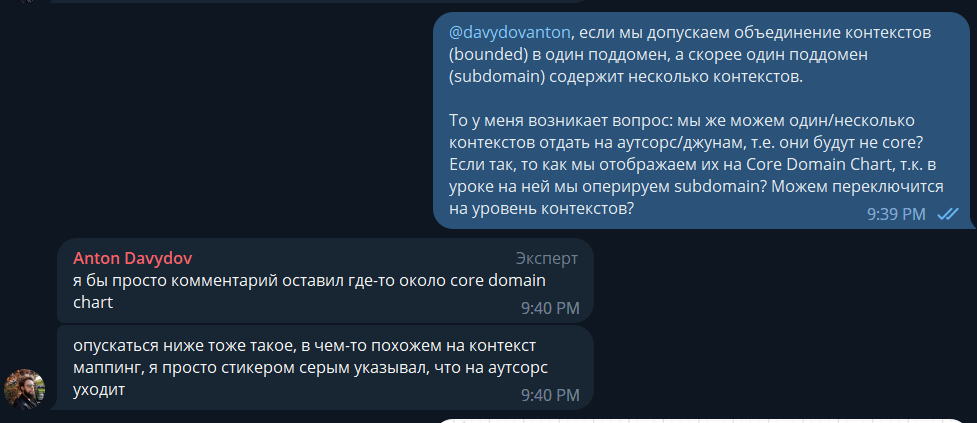
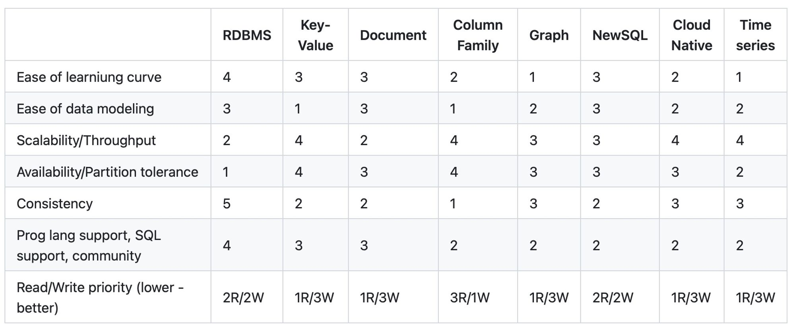

# Make Cats Free

Задача курса: **обучиться и получить набор навыков для обосновывания решения при выборе той или иной архитектуры проектируемой системы.** 

Описание задачи и требования здесь:
[Requirements](Requirements.md)

## Задание второй домашки

1. Core Domain Chart
2. Определить bounded-контексты, сделать модель с поддоменами
3. Описать разницу между bounded-контекстами первого урока и второго
4. Найти и выписать характеристики и выбрать один из четырех стилей

## Задание третьей домашки

1. Описать структуру системы с архиеткурными стилями
2. Выбрать виды баз данных
3. Выбрать стили коммуникаций
4. Написать ADR

# Анализ

Основным результатом анализа являются **обнаруженные элементы системы и их связи.** Поэтому, говоря о анализе в двух словах, можно сказать, что он должен быть выстроин таким образом, чтобы понять с какими элементами системы системы придется иметь дело команде разработки, и как связи между элементами повлияют на эту разработку. 

## Анализ домена

*Анализ домена компании является стратегическим анализом. Через основные цели компании и область, которой они занимаются можно делать некий прогноз и анализировать не только текущее состояние системы, а и возможные направления её развития*

**Главная цель MCF - это освободить котов-тестировщиков от рутинной работы, осовбождая им дополнительное время на более важные дела).**

В прошлом уроке выполнил первую итерацию по анализу домена, после разбора домашки, пересмотрел декомпозицию проблемы на поддомены.

И ответил на свой же вопрос: 

Проблема была в том, **что я не до конца разбил общую проблему на подпроблемы, и в качестве поддомена подразумевал слишком большой кусок:** "Выполнение работ для клиентов", в который входили и "Магазин", "Подбор воркеров", "Сборка расходников", "Работа воркеров". Естественно к такому поддомену невозможно применить один определенный тип: Core, Generic, Supporting. Точнее, он получает самый высокий приоритет - тип Core. И ценность такого разбиения падает, т.к. например, магазин можно отнести к Generic и нет необходимости его рассматривать, как ключевый элемент для бизнеса. 

*Пролема схожа с тем, как в ООП при выборе класса нарушается один из главных принципов SOLID - Single-responsibility principle, т.е. "Выполнение работ для клиентов" "занимался всем подряд": брал на себя все ответсвенности Core, Generic, Supporting*

В итоге, за основу декомпозиции доменов и контекстов взят вариант Антона из разбора домашки, полагаясь на него как на эксперта доменной области, и в том числе, чтобы сэконоимть время и сфокусироваться на следующем шаге (спасибо Антон ;))

Вот что было:

Что стало:

Кажется есть проблема с цикличностью между элементами "Найм воркера" и "Подбор воркера". Как минимум присутствует связность по данным, т.к. "Пул воркеров" должен быть засинхронизирован между тремя контекстами, учитывая что "Пула воркеров"-owner это контекст тестирование канидатов.

## Анализ интересов участников (stakeholder concerns)

*При рассмотрение интересов всех участников процесса, а не только бизнеса можно изменить как структуру системы, так её характеристики, найти дополнительные ограничения*

Все основные явные интересы представлены в виде списка в требованиях [[Requirements#Stakeholder concerns|Stakeholder concerns]]

### Влияние на характеристики сиcтемы

В соответсвии c советом

> Если стейкхолдер говорит о технических деталях — **переводите это в характеристики.**

Определил доп. характеристики к [[week2/README#Анализ характеристик|основным характеристикам]]:

- Скоринг, на сколько я понял - это элемент "Онлайн тестирование кандидатов" в поддомене Найм воркеров. [[Requirements#SC-020|Бизнес в будущем хочет продавать его другим компаниям и тестировать больше гипотез]], т.е. планируется регулярный выкат гипотез **deployability** , и также если нужно продовать скоринг потребуется интеграции с партнерами **simplicity**

- [[Requirements#SC-040|приходит не 10 заказов в день, а 10 заказов в минуту]] добавляет к элементу "Магазин" **scalability**, **availability**, **performance**

- Из [[Requirements#SC-070|cистема должна работать без сбоев]] и [[Requirements#SC-080|простота мониторинга системы для своевременного замечания сбоев]] в целом к системе стоит добавить **maintainability**, **debuggability**

- Для элементов "Списание с клиентов" и "Зачисление зарплаты воркером" [[Requirements#SC-060|боятся потерять любую финансовую информацию]] добавляет характеристику **reliability**

**Не учтены интересы воркеров, канжидатов в воркеры, работников склада, производителей печенек.**

Исходя из того, что работники склада не относятся к core-поддомену, я бы сфокусировался на интересах кандидатов в воркеры и воркеров, так как они являются пользователями системы найма и исполнения заказа - ключевых поддоменов MCF. 

Производителей печенек так же надо опросить, т.к. скорее всего возникнут доп ограничение в контексте "Сборка/Хранение расходников". Ограничение типа использование специфичного/легаси API, которое повлечет бОльшую сложность: дополнительно появится характеристику **testability** и какая-то еще)).

### Влияние на структуру системы

Основываясь на [[Requirements#SC-030|Они хотят скрыть эту систему даже от разработчиков]] можно сказать, что систему ставок мы точно НЕ разрабатываем и интегрируемся с готовым решением, либо для упрощения, убираем её вовсе.

[[Requirements#SC-050|списывать деньги с клиентов каждую неделю слишком затратно для отдела,]] видимо, направлено на то, что нужно выделить два разных контекста для списание и начесления зарплаты, на что Антон акцентировал внимание при разборе второй домашки

## Анализ внешних ограничений

*Внешние ограничения могу возникнуть из явных требований к системе, из интересов stakeholder-ов, из особенности домена, из ограничений в ресурсах разработки, из правовых аспектов.*

В данном проекте мы имеем ~~два~~ одно четко прописанное ограничение:

1. ~~Отсутствие ограничение на бюджет)~~
2. **Соблюдение CatFinComplience,** т.е. вносит требования по хранению финансовых данных, т.е. актуально для двух элементов "Списание с клиентов" и "Зачисление зарплаты воркером".

## Выбор архитектурного стиля 2

Для начала соберем все характеристики и ограничения.

- Для всей системы в целом: **agility**, **modifiability**, **deployability**, **testability**, **maintainability**, **debuggability** (что-то очень много =) )

- Для "Магазина": **scalability**, **availability**, **performance**

- Для "Онлайн тестирования кандидатов" (Скорринг): **simplicity**, **security**

- Для элементов "Списание с клиентов" и "Зачисление зарплаты воркером": **security**, **reliability**, **соблюдение CatFinComplience**

Аналогично уроку:

> По модели у Ибрагима есть три главные характеристики: **agility,** **deployability** и **testability.** Монолиты, судя по таблице стилей, не подходили. Зато подходило два распределённых — service-based и микросервисы.

**основные характеристики говорят о том, что при выборе архитектурного стиля не стоит смотреть в сторону чистого монолита, поэтому задача сводится к декомпозиции на сервисы**

### Выбор структуры системы

Вот список всех элементов:

> **если характеристики или внешние ограничения двух элементов можно объединить, значит, их нужно объединять в один сервис**

*Не удалось это правило применить, хотя полагаю, что по задумке нужно было. 
В местах где хотелось, например, объединение Проверки качества и Магазина. Но они с появлением новых требований, разошлись по характеристикам Магазин "стал" более нагруженный, а Проверка качества нет.*

В итоге, текущий вариант структуры выглядит так:

- две внешние системы, о которых можно не думать (аналогично уроку)
- шесть независимых сервисов 
- одна группа сервисов для реализации "Магазина". Либо микросервисы, либо service-based подход. В качестве компонентов, можно рассмотреть: Order, Basket, Catalog.
- один microkernel, для проверки гипотез скорринга
- возможно один pipeline, для осуществления шагов при матчинге

#### Магазин услуг для клиентов. Неоднозначности 

**Использование терминологии микросервис или монолит, как по мне, очень неоднозначное.** Всё очень сильно зависит от контекста. Например, в нашем случая, если мы говорим о всей системе в целом, то использование одного монолита не допустимо, следовательно мы разбиваем систему на сервисы, и многие из этих сервисов являются монолитами =) но при этом мы не используем микросервисный подход в целом?

*Для меня термин "сервис" ассоциируется с приложением, которое не занимается UI, обеспечивает работу API, Background Task. Т.е. монолит занимающейся и UI и основной логикой и интеграциями в моей голове не прикрепляется к термину сервис. "Приложение" в этом случая более применимо*

// TODO: Разобраться с терминами и подходами подробнее, особенно в разнице между event-driven и микросервисами

Поэтому элемент "Магазин" я обозначил как группу сервисов, не как один сервис. Подход же Микросервисы или Service-based выбран в соотвествии с характеристиками: **scalability**, **availability**, **performance**.

По идее, если мы имеем несколько микросервисов, то должны также декомпозировать "Магазин" и показать их на диаграмме, плюс выбрать коммуникации и БД для каждого из них, но в целях экономии времени отставляю так как есть. 

*Получается если мы какой-то элемент реализуем с помощью распределенного стиля (микросервисы, service-based?), то автоматом мы проектируем всю систему в этом стиле, т.к. появляется важная задача по реализации коммуникаций между элементами, что является краеугольным камнем в микросервисном подходе.*

#### Использование монолита

Для элементов: сборка/хранение расходников, проверка качества заказов, списание средств и зачисление зарплаты выбран layered-монолит из соображение простоты реализации, данные элементы лежат в supporting-поддомен не являются ключевыми, поэтому их можно реализовывать без core-комманды.

*Думал о том, что если сервисы Расчета зарплат и Списания средств не сильно сложные с точки зрения UI, то можно рассмотреть вариант внесения их в группу сервисов Магазин. Но отказался от этого, из-за специфичных ограничений CatFinComplience. Если фин-сервисы объеденить с Магазином, то они будут автоматом накладывать ограничение на фунционирования кластера микросервисов магазина, например, нельзя будет использовать облака для масштабирования и т.д. и т.п.*

#### Специфичные стили

*Чёткого представления по microkernel и pipeline не имею, на практике не сталкивался, но судя по описанию, возможно, они имеют смысл в выбранных контекстах.*

Для "Онлайн тестирования кандидата (скорринга)" выбрал microkernel он отвечает характеристикам -  **simplicity**, **security**. Так же обеспечивает более прокаченный **deployability**, т.к. в отличии от всей системы релизы этого компонента запланированны чаще [[Requirements#SC-020|релизный цикл для всей системы — месяц, для скоринга работников — неделя максимум.]]. Но при всем, он дешевле в реализации чем остальные, кроме монолита. Гипотезы можно запихнуть в Plug-in, а для их загрузки и использование запилить единый интерфейс.

Для элемента матчинга можно попробовать pipeline стиль. Выбор пал на него только из-за природы алгоритма матчинга, который состоит из последовательности шагов, которые могу в течении жизни меняться. Если это не учитывать возможно выбрать вариант по умолчанию - layered-монолит.

### Выбор баз данных

Имеем рекомендацию по выбору базы данных из урока:

- Для фин-элементов (Списание средств и расчет зарплаты) используем реалиционные БД, аналогично уроку по требованию CatFinComplience (**consistency**)

- Для матчинга, вероятно, подойдет графовая база данных, т.к. основные данные (характеристики воркера) могут меняться и не имметь чёткой структуры, плюс для корректировки алгоритм могут задействованы data scientist-ы

- Для группы сервисов Магазин, скорее всего необходимо несколько БД, возьмем дефолтный вариант с реляционными БД, хотя есть проблемы со скейлом

- Для всех монолитных решений, аналогично реляционные БД из соображений простоты

- Для тестирования кандидатов (скорринга) возможно использования документной БД: хранения анкет для тестирования и опять же информации по характеристикам воркера не очень структурированна и самое главное может часто меняться со временем.

### Выбор коммуникаций

*На коммуникации мне не хватило ресурсов, сделал их формально*

Аналогично уроку создаю диаграмму коммуникаций:

Пунктирные стрелки ассинхронная коммуникация, сплошные синхронная. Синие бизнес события, красные стримминг.

- Для фин-элементов нужно передавать бизнес событие, для аккаунтинга, на схеме указал только стриминг информации по заказу. Попутно возник вопрос: **Если мы не должны реагировать сразу на событие из внешнего элемента (расчет зарплаты не актуален "прямо сейчас"), то в достаточно ли стриминг события для актуализации данных?** 

-  Для взаимодействия с внешними системами синхронная коммуникация, аналогично уроку (полагаем, что с внешней системой мы не можем работать по другому). 

- Также синхронная коммуникация для матчинга, т.к. необходимо при оформлении заказа сразу получить воркера (требования), только после этого можно запустить дальнейшие процессы

## Кусочек ADR-001 (Architectural decision records)

*Неполный, "я его слепила из того, что было". Обозначил просто состав ADR - тизер)*

Пример ADR-документа, который описывает общие моменты при выборе решения
Должен лежать в **application/common

### Status: *Accepted*

### Context

Основываясь на требованиях и интересах стейкхолдеров, было определено, что необходимо реализовать систему из девяти боундед-контекстов, каждый из которых имеет свой набор характеристик.

- Для всей системы в целом: **agility**, **modifiability**, **deployability**, **testability**, **maintainability**, **debuggability**

- Для "Магазина": **scalability**, **availability**, **performance**

- Для "Онлайн тестирования кандидатов" (Скорринг): **simplicity**, **security**

- Для элементов "Списание с клиентов" и "Зачисление зарплаты воркером": **security**, **reliability**, **соблюдение CatFinComplience**

Из явных требований указано только:

- Соблюдение CatFinComplience

### Decision

В основу архитектуры был выбран микросервисный стиль

// TODO: Описание каждого сервиса

### Сompliance

> Так как нет вариантов автоматической проверки реализации архитектурного стиля, то вся проверка будет делаться вручную посредством изучения проектной документации, кода и автоматически генерируемой карты сервисов, основанной на инструментах трассировки.
